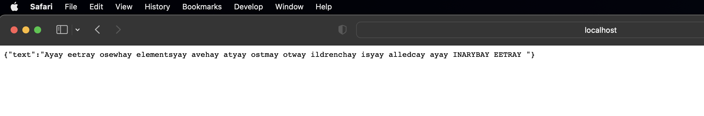

# Pig Latin game
Pig latin game demo 

- [Github repository](https://github.com/roldanwilfrido/piglatin)


# Software Requirements

Project with the latest available versions of the following:

* Spring Boot 3.0.0
* Spring Web
* Java 17 - **Check out [SDKMAN!](https://sdkman.io/)**
* Gradle 7.5+


## Running application

1. Compiling and running unit tests
```
./gradlew clean test bootJar
```
2. Starting the App
```
./gradlew bootRun
```

## Using application

- Translate a sentence

<b>URL</b>: [GET] http://localhost:8080/play?input=<Your sentence>

Response:

<i>For input= A tree whose elements have at most two children is called a BINARY TREE)</i>




## Details

* Controller (Spring web)
* Service (Spring Framework)

Any further information please email me to roldanhollow@gmail.com

[If you liked it, please buy me a 🥭 juice ✋🏻😁!](https://paypal.me/Sanidapp)

Enjoy!